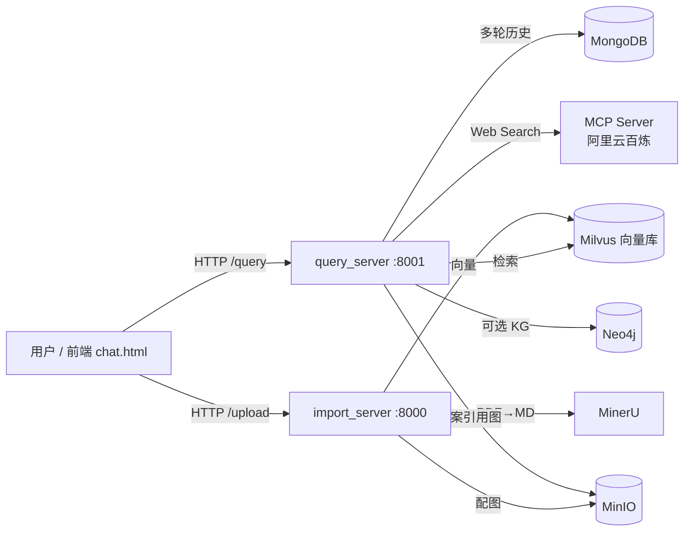
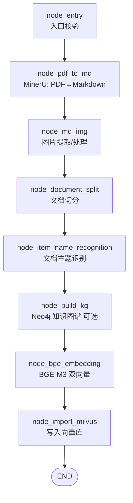
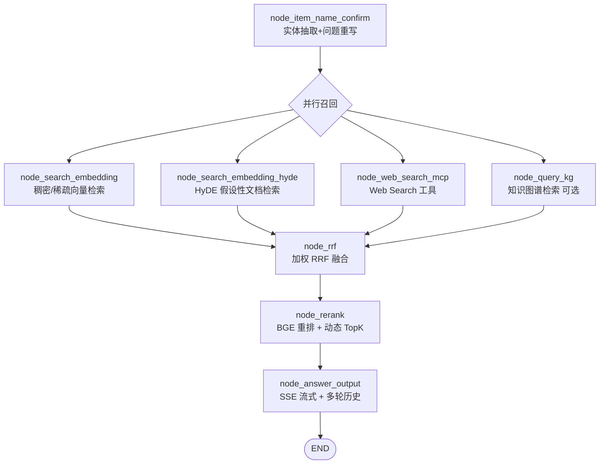
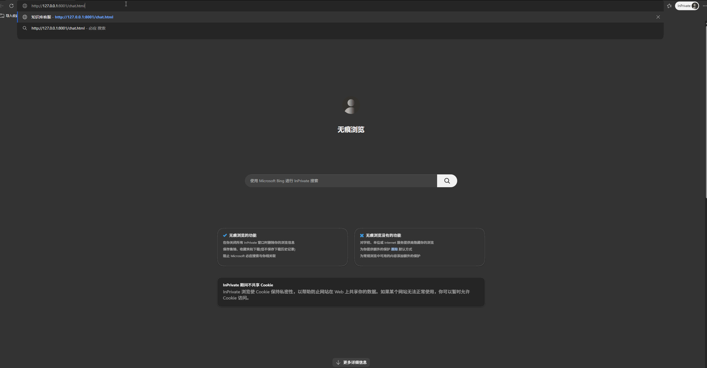

# 技术文档智能问答系统

> 基于 LangGraph 编排的 RAG 应用：面向 Agent / LLM / Python 等技术文档，提供「混合检索 + 重排序 + 流式回答 + 多轮对话」的企业级问答能力。

一套完整的检索增强生成（RAG）系统，覆盖**文档导入**与**问答推理**两条 LangGraph 流水线，支持稠密+稀疏混合向量检索、HyDE 假设性文档增强、加权 RRF 融合、BGE 交叉编码器重排、Web Search 工具调用（MCP）、SSE 流式输出与 MongoDB 多轮记忆。

---

## ✨ 核心特性

- **双图编排（LangGraph）**：导入图 8 节点、查询图 7 节点，状态在节点间流转，逻辑清晰可观测。
- **混合检索**：BGE-M3 双向量（稠密 `HNSW + COSINE` / 稀疏 `SPARSE_INVERTED_INDEX + IP`）并行召回。
- **HyDE 增强**：将用户问题改写为「假设性答案文档」再做向量检索，提升语义召回。
- **加权 RRF 融合**：多路召回（向量 / HyDE / 网络 / 知识图谱）统一融合排序。
- **BGE 重排**：交叉编码器重排 + 动态 TopK + 断崖检测，过滤噪声片段。
- **工具调用（MCP）**：通过 `openai-agents` 的 StreamableHttp MCP 接入 Web Search，补充实时 / 库外知识。
- **流式体验**：SSE 实时推送检索进度（节点级可视化）+ 逐字生成答案，首字延迟 ~507ms。
- **多轮记忆**：MongoDB 存储对话历史，支持上下文连续追问。
- **多模态**：MinIO 存储技术文档配图，答案可引用图片。
- **可评估**：内置 RAGAS 评估脚本（忠实度 / 相关性 / 上下文精度·召回）。

---

## 🏗️ 技术架构

### 系统总览



### 导入流水线（Import Graph，8 节点）



### 查询流水线（Query Graph，7 节点）



---

## 🧰 技术栈

| 层 | 技术 |
|----|------|
| 编排 | LangGraph 1.2.x |
| LLM | OpenAI 兼容接口（模型可配置，`LLM_DEFAULT_MODEL`） |
| 嵌入 / 重排 | BGE-M3（`flagembedding`，稠密+稀疏双向量）、BGE 交叉编码器重排 |
| 向量库 | Milvus（`pymilvus` 3.x），稠密 `HNSW+COSINE` / 稀疏 `SPARSE_INVERTED_INDEX+IP` |
| 文档解析 | MinerU（`magic-pdf`） |
| 对象存储 | MinIO（技术文档配图） |
| 对话历史 | MongoDB |
| 工具调用 | Web Search MCP（`openai-agents` StreamableHttp → 阿里云百炼） |
| 评估 | RAGAS 0.2.15 |
| API / 流式 | FastAPI + SSE（`EventSource`） |
| 运行时 | Python ≥ 3.12 |

---

## 🚀 快速开始

### 前置依赖
- Python ≥ 3.12
- 已部署的 Milvus、MongoDB、MinIO（本仓库不包含这些服务的部署）
- 可用的 LLM API（OpenAI 兼容）、MinerU API、阿里云百炼 MCP 凭证

### 1. 安装依赖
```bash
uv sync
# 或：pip install -e .
```

### 2. 配置环境变量
复制模板并填写 `.env`：
```bash
cp .env.example .env   # 然后填入真实 API Key 等配置
```
关键变量：

| 类别 | 变量 |
|------|------|
| LLM | `OPENAI_API_KEY` `OPENAI_BASE_URL` `LLM_DEFAULT_MODEL` `LLM_DEFAULT_TEMPERATURE` `VL_MODEL` |
| 嵌入 / 重排 | `EMBEDDING_DIM` `BGE_RERANKER_LARGE` `BGE_RERANKER_DEVICE` |
| Milvus | `MILVUS_URL` `CHUNKS_COLLECTION` `ITEM_NAME_COLLECTION` `ITEM_NAME_DIAG` |
| MongoDB | `MONGO_URL` `MONGO_DB_NAME` |
| MinIO | `MINIO_ENDPOINT` `MINIO_ACCESS_KEY` `MINIO_SECRET_KEY` `MINIO_BUCKET_NAME` `MINIO_IMG_DIR` |
| Web Search MCP | `MCP_DASHSCOPE_BASE_URL` `MCP_DASHSCOPE_BASE_URL_STREAMABLE` |
| 文档解析 | `MINERU_API_TOKEN` `MINERU_BASE_URL` `MINERU_MODEL_SOURCE` |
| 知识图谱（可选） | `NEO4J_URI` `NEO4J_USERNAME` `NEO4J_PASSWORD`（留空则跳过） |

### 3. 启动服务（两个终端）
```bash
# 终端 1：导入服务（端口 8000）
python -m app.import_process.api.import_server

# 终端 2：查询服务（端口 8001）
python -m app.query_process.api.query_server
```

### 4. 打开对话界面
浏览器访问 `http://127.0.0.1:8001/chat.html`

---

## 📊 评估指标（真实运行）

运行 `python -m app.eval.ragas_eval`（基于 `app/eval/sample_dataset.json` 的技术文档问答样本）：

| 指标 | 实测值 |
|------|--------|
| faithfulness（忠实度） | `0.898` |
| answer_relevancy（答案相关性） | `0.761` |
| context_precision（上下文精确度） | `0.900` |
| context_recall（上下文召回率） | `1.000` |
| 平均首字延迟（TTFT） | `~507 ms`（5 次问答均值，范围 368–659 ms） |

> 数值为 10 条技术文档问答样本的 RAGAS 均值（详见 `app/eval/ragas_report.json`）。`context_recall` 满分、`context_precision` 0.90 说明检索召回质量高、噪声少；`faithfulness` 0.90 表明答案基本严格基于检索上下文；`answer_relevancy` 0.76 反映部分答案偏精简、仍有展开空间。样本已覆盖 RAG 基础 / 混合检索 / HyDE / 重排 / 多智能体 / Function Calling+MCP / GraphRAG / Agent 沙箱 / SSE 等核心技术点，建议后续继续扩充（跨文档 / 多跳问题）以提升评估置信度。

---

## 📁 项目结构

```
app/
├── clients/            # 外部服务客户端（Milvus / MinIO / MCP 等）
├── conf/               # 配置
├── core/               # 日志、Prompt 加载等基础设施
├── eval/               # RAGAS 评估（ragas_eval.py / sample_dataset.json / ttft_metrics.jsonl）
├── import_process/     # 导入服务：api / agent(导入图) / page
├── lm/                 # LLM 客户端封装
├── query_process/      # 查询服务：api / agent(查询图) / page(chat.html) / sse
├── tool/               # 工具
└── utils/              # 任务状态、SSE 队列等工具
doc/                    # 技术文档原始文件（体积较大，不入库）
prompts/                # Prompt 模板
```

---

## 🔌 可选：Neo4j 知识图谱

知识图谱检索（`node_query_kg`）作为查询图的**第 4 路并行召回**已实现，并通过环境变量门控：

- 在 `.env` 填写 `NEO4J_URI` / `NEO4J_USERNAME` / `NEO4J_PASSWORD` 后自动启用；
- 导入图的 `node_build_kg` 会在导入时抽取实体关系写入 Neo4j；
- **未配置时安全降级**，主流程（向量检索）不受影响。

---

## 🐳 容器化部署

使用 Docker Compose 一键拉起全部依赖（Milvus / etcd / MinIO / MongoDB）与应用服务：

```bash
cp .env.example .env          # 填入 API Key 等配置
docker compose up -d          # 构建镜像并启动全部服务
```

- 导入服务：http://localhost:8000/import
- 查询服务：http://localhost:8001/chat.html
- Milvus 默认端口 `19530`，MongoDB `27017`，MinIO `9000`（控制台 `9001`，默认 `minioadmin/minioadmin`）；首次运行请在 MinIO 控制台创建存储桶 `knowledge-base-files`

> 应用镜像基于 `Dockerfile` 构建；依赖服务通过 Compose 编排。知识图谱（Neo4j）为可选模块，未纳入默认编排，需自行部署后于 `.env` 配置启用。

## 🎬 在线演示



---

## 🗺️ 后续规划

- **容器化与一键部署**：提供 `Dockerfile` 与 `docker-compose.yml`，降低本地搭建门槛。
- **评测闭环增强**：扩充 RAGAS 跨文档 / 多跳样本，建立回归基线。
- **Agent 能力扩展**：引入任务规划循环（ReAct 反思）与多 Agent 协同，覆盖更复杂决策场景。
- **性能与可观测**：补充缓存层、异步任务队列与全链路指标（成功率 / 延迟 / Token 用量），向生产级演进。

> 当前版本聚焦 RAG + Agent 编排的工程落地与可复现评估，已在有限样本下验证各模块质量，并持续扩充语料与指标口径。
